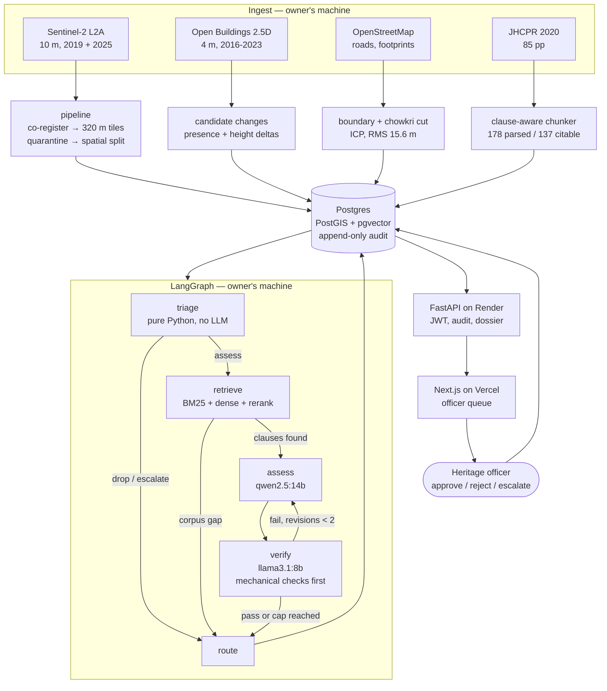

# VIRASAT

**A heritage compliance evidence engine for the Jaipur Walled City UNESCO World
Heritage property.** UNESCO inscribed the walled city in 2019 and requires the State
Party to report on the condition of the property and the effectiveness of its
protection; the Jaipur (Walled City) Heritage Conservation and Protection Regulations
2020 are the instrument that protection runs on, and the next State of Conservation
reporting cycle closes in **December 2026**. Across 643 hectares of core zone and 1,994
hectares of buffer, the Heritage Cell has to know what was built, raised or demolished,
and under which clause each of those changes falls. VIRASAT detects built-form change
from open satellite imagery, retrieves the clauses that govern it, drafts an assessment,
attacks that draft with a second model, and hands what survives to a named heritage
officer. It decides nothing.

---

## What this does not do

Stated first, because it is the part that matters.

* **It does not enforce anything.** There is no path from this system to a citizen, a
  notice, or an enforcement database. Every output is a recommendation addressed to a
  named officer, who approves, rejects with a mandatory written reason, or escalates.
* **It does not make unsupported claims.** A finding cannot be stored unless it cites a
  clause that retrieval actually returned — `findings.clause_id` is a foreign key onto
  the corpus — and references the specific evidence crop. There is no override.
* **It does not invent data.** Every metric below that has not been measured says
  BLOCKED and names what would unblock it. Nothing on this page is estimated,
  extrapolated, or carried over from a paper.
* **It does not hold personal data.** No names, owners, tax records or faces. Street
  imagery is blurred in memory at ingest, before anything is written to disk.
* **It is not calibrated.** The confidence score attached to a candidate is a raw model
  score, not a probability, and must not be read as one until the calibration run in
  `vision/calibrate.py` has labels to run on.

## Architecture



The verifier runs on a **different model family** from the assessor, checked at startup
by `assert_distinct_families()`, which fails the run rather than the finding. Three
deterministic rules execute before the verifier model is invoked at all: the cited
clause must be one retrieval returned, the evidence reference must be the supplied crop,
and the claim must contain no enforcement language.

## Results

Measured on the data actually on disk, 2026-09-09. **Every model-quality metric is
BLOCKED**, because the label sets that would produce them do not exist yet. They are
listed anyway, with their targets and their blockers, because a results table with
honest gaps is more useful than a results table with plausible numbers.

| Metric | Target | Result | Blocker |
|---|---|---|---|
| Detector recall | ≥ 0.85 | **BLOCKED** | 0 of 400 tile labels; no trained checkpoint |
| Detector FPR | ≤ 0.15 | **BLOCKED** | as above |
| Calibration error (ECE) | ≤ 0.05 | **BLOCKED** | as above |
| Retrieval precision@3 | ≥ 0.90 | **BLOCKED** | 0 of 60 labelled clause pairs |
| Retrieval recall@5 | ≥ 0.85 | **BLOCKED** | as above |
| Verifier catch rate | ≥ 0.80 | **BLOCKED** | red-team set not built; needs labelled clauses |
| Per-ward FP disparity | ≤ 1.5 | **BLOCKED** | needs ≥ 20 officer decisions across ≥ 2 chowkris; have 0 |

`uv run eval --gate` regenerates this into `eval/reports/<timestamp>/report.md`. The gate
exits non-zero only on a *measured* failure or a ≥ 0.02 regression. BLOCKED never fails
the build and never prints a number.

### What has been measured

These are counts and geometric residuals, not model quality — they are reported because
they were actually computed.

| Quantity | Value |
|---|---|
| Boundary georeferencing | 95 % of control vertices matched, RMS **15.6 m**, median 10.7 m |
| Core / buffer area recovered | 643 ha / 1,994 ha, both ~9.5 % under the inscribed 710 / 2,205 ha |
| Tiles produced | **780** (core 75, buffer 155, outside 550) |
| Co-registration residual | median 0.1 px, p95 0.2 px; quarantine rate **0.38 %** |
| Spatial split | 431 train / 214 val / 135 test, whole chowkris held out |
| Corpus | **178** clause chunks parsed, **137** indexed as citable |
| Candidate changes | **101** from Open Buildings presence and height deltas, 2016→2023 |
| Agent run, 2026-09-09 | 82 dropped with no model call · 5 escalated direct · 14 assessed |
| Findings stored | **11**, all citing a retrieved clause and a real evidence crop |
| Findings passing verification | **0** |
| Draft findings rejected before storage | 12, logged to the audit trail |
| Audit rows | 112, on a table whose UPDATE/DELETE triggers raise |

**The headline result is that zero findings survived verification.** The local
qwen2.5:14b assessor produces drafts that cite a real clause and reference real
evidence, and the llama3.1:8b verifier rejects them on substance — typically for citing
a topically-related clause that does not support the specific claim (e.g. ACG-4.1, which
governs door openings, offered in support of a claim about storey height). Every one of
the 14 assessed changes therefore reached an officer as `needs_human_rewrite` with the
draft attached. That is the system behaving as designed and being conservative, not the
system working well: a useful assessor would produce drafts that survive. Whether that
requires a larger assessor, a better corpus, or a labelled retrieval pass is exactly
what the BLOCKED metrics above would tell us.

Provenance note: 13 of the 14 changes were verified under prompt `verify.v1.md` and one
under `verify.v2.md`. Each `audit_log` row records the prompt versions and model ids
that produced it, so the two are distinguishable rather than blended.

## Fairness

Per-chowkri false-positive disparity is a **blocking** gate, not a report. It is
published here whatever it says.

| Chowkri | Officer decisions | False positives | FP rate | Ratio to median |
|---|---|---|---|---|
| Purani Basti (90.1 ha) | — | — | — | — |
| Sarhad (168.3 ha) | — | — | — | — |
| Ghat Darwaza (77.0 ha) | — | — | — | — |
| Topkhana Hazuri (71.8 ha) | — | — | — | — |
| Topkhana Desh (66.7 ha) | — | — | — | — |
| Ramchandraji (65.3 ha) | — | — | — | — |
| Gangapole (35.9 ha) | — | — | — | — |
| Modikhana (33.9 ha) | — | — | — | — |
| Vishveshwarji (33.6 ha) | — | — | — | — |

**BLOCKED** — the gate requires at least 20 officer decisions spread over at least two
chowkris. The database holds 3 decisions, all on candidates outside the core, so no
chowkri has any. A disparity ratio computed from this would be noise with a decimal
point, and it would be quoted.

The chowkri **names** in this table are themselves an unverified inference from the
published grid description and must be confirmed with the JNN Heritage Cell before any
of it is used administratively. See `docs/DATA_CARD.md`.

## Ablations

| Ablation | Question it answers | Result |
|---|---|---|
| Spatial vs random split | How much of the detector's score is leakage between adjacent tiles? | **BLOCKED** — needs a trained detector |
| Clause-aware vs fixed-size chunking | Does structural chunking improve citation precision? | **BLOCKED** — needs 60 labelled pairs |
| Verifier on / off | How many unsupported findings does the second model stop? | **BLOCKED** — needs the red-team set |
| Same-family vs cross-family verifier | Do correlated errors let bad findings through? | **BLOCKED** — as above |
| Rerank on / off | Does the cross-encoder earn its latency? | **BLOCKED** — needs 60 labelled pairs |

Every one of these is scaffolded and idle. Labels are the only input missing.

## Quickstart

```bash
git clone https://github.com/krish2105/virasat && cd virasat
docker compose up -d --wait db     # Postgres 16 + PostGIS 3.4 + pgvector, host port 5434
uv sync                            # uv, not pip or poetry
uv run alembic upgrade head        # creates postgis and vector itself
```

Data acquisition needs the sources in the table below; `data/MANIFEST.md` records every
file with its SHA-256. With the corpus PDF and imagery in `data/raw/`:

```bash
uv run pipeline                              # co-register, tile, split
python -m virasat.rag.chunk                  # 178 clause chunks
python -m virasat.rag.index                  # embed the 137 citable ones (needs Ollama)
python -m virasat.vision.open_buildings      # candidate changes
python -m virasat.vision.infer               # materialise them with evidence crops
uv run agents --limit 20 --zone core         # the assessment graph
uv run eval --gate                           # metrics + fairness gate
uv run seed-admin <username>                 # first officer account
```

Then the two servers:

```bash
uv run uvicorn virasat.api.main:app --port 8000
pnpm --dir web dev
```

Local models come from Ollama (`qwen2.5:14b-instruct` to assess, `llama3.1:8b` to
verify). Set `VIRASAT_CLOUD=1` with an `ANTHROPIC_API_KEY` to route to
claude-sonnet-5 / claude-opus-5 instead; the distinct-family check applies either way.

Deployment on free tiers is in **[docs/DEPLOY.md](docs/DEPLOY.md)** — read the 30-day
expiry warning on Render's free Postgres before you start.

### Checks that must stay green

```bash
uv run ruff check . && uv run mypy src && uv run pytest
pnpm --dir web typecheck && pnpm --dir web lint
```

## Data sources and licences

| Dataset | What | Resolution / date | Licence |
|---|---|---|---|
| Sentinel-2 L2A, tile 43REK | B02/B03/B04/B08 windowed to the study bbox | 10 m; 2019-12-26 and 2025-12-04 | Copernicus — free and open |
| Google Open Buildings 2.5D Temporal v1 | Building presence, count, height | ~4 m effective; annual 2016–2023 | CC BY 4.0 / ODbL 1.0 |
| OpenStreetMap | Roads, city wall, gates, 7,579 footprints | as of 2026-09-09 | ODbL — attributed in the UI footer |
| UNESCO WHC document 176277 | Vector map of the property and buffer | 1:10,000 nominal | UNESCO statutory document |
| JHCPR 2020 | The regulation, incl. the Architectural Control Guidelines annexure | notified 2020, 85 pp | Government of Rajasthan public notification |

Google Street View is **not** used: its licence forbids machine-learning use. Street-level
evidence is designed against Mapillary (CC BY-SA) and is currently blocked on a token.

## Known limitations

1. **Every model-quality number is BLOCKED.** 400 tile labels and 60 clause-pair labels
   are the gating input for the detector, the calibration, the retrieval metrics, the
   verifier catch rate and all five ablations.
2. **No finding has passed verification.** See Results. The system is conservative in
   the safe direction, which is the right failure, but it is a failure.
3. **The boundary is ~9.5 % small.** Core and buffer areas come out at 643 / 1,994 ha
   against the inscribed 710 / 2,205 ha, from georeferencing a 1:10,000 nominal map by
   ICP against OSM roads. Recorded in `data/boundaries/georeference_report.json`, not
   hidden, and not yet closed.
4. **Chowkri names are an inference**, not a source. Boundaries are derived by PCA cuts
   through the OSM bazaar streets; the name-to-block mapping needs Heritage Cell
   confirmation.
5. **`applies_to_change_type` on each clause is keyword-derived** by regex over clause
   text, and it gates retrieval. It needs a labelled pass.
6. **Sentinel-2 at 10 m is too coarse for individual buildings.** Building-scale signal
   comes from Open Buildings at ~4 m; LISS-4 at 5 m is registered for but not acquired.
7. **Four corpus chunks remain oversized** (the new-construction section), so their
   citations are less precise than the rest.
8. **A corpus gap is discarded as an error string.** When retrieval returns nothing that
   is a fact about the regulation's coverage and should be reported, not swallowed.
9. **Re-indexing the corpus after findings exist will fail** on the `findings.clause_id`
   foreign key. Re-index before an assessment run, not after.
10. **The hosted deployment has no model runtime**, by design. Assessment is run from
    the owner's machine against the same database.

## Documentation

| Document | What is in it |
|---|---|
| [docs/ARCHITECTURE.md](docs/ARCHITECTURE.md) | Every decision, and the evidence that forced it |
| [docs/VIVA.md](docs/VIVA.md) | The ten design questions, answered from the built system |
| [docs/DATA_CARD.md](docs/DATA_CARD.md) | Provenance, extents, SHA-256, known gaps |
| [docs/MODEL_CARD.md](docs/MODEL_CARD.md) | Intended use, out-of-scope use, failure modes |
| [docs/ETHICS.md](docs/ETHICS.md) | Harms considered and what in the design addresses them |
| [docs/DEPLOY.md](docs/DEPLOY.md) | Free-tier deployment, and the 30-day database clock |

## Licence and status

Research prototype. Not a decision system, not a compliance product, and not endorsed by
the Jaipur Nagar Nigam, the Rajasthan Department of Local Self Government, or UNESCO.
